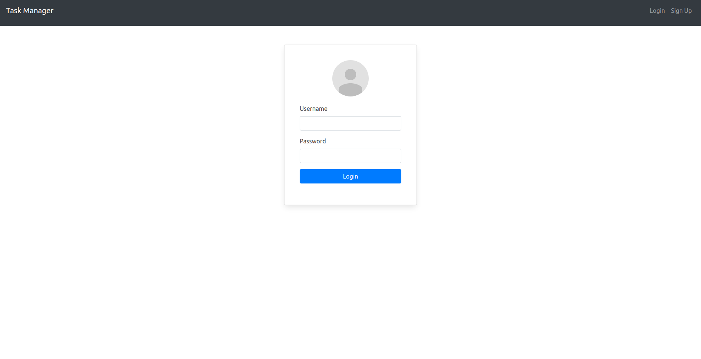
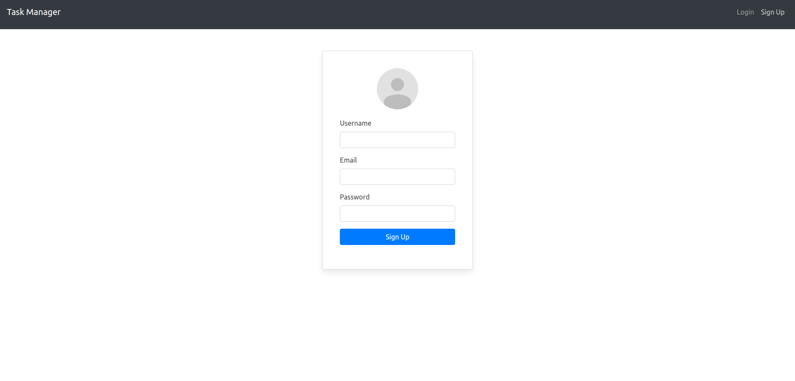
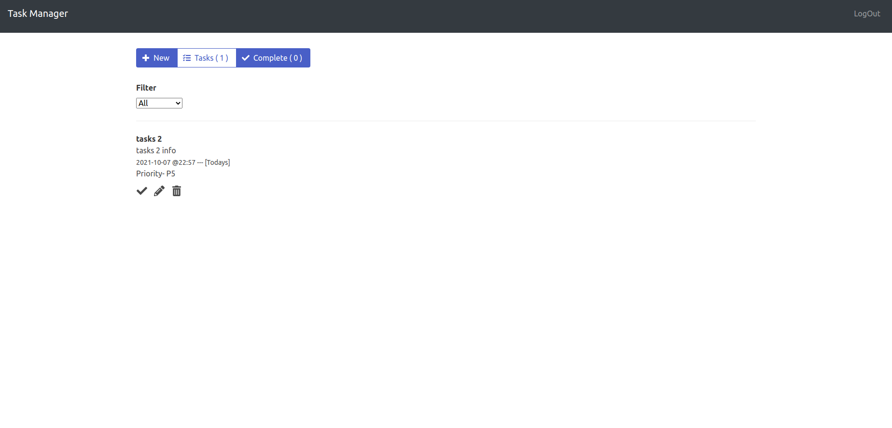
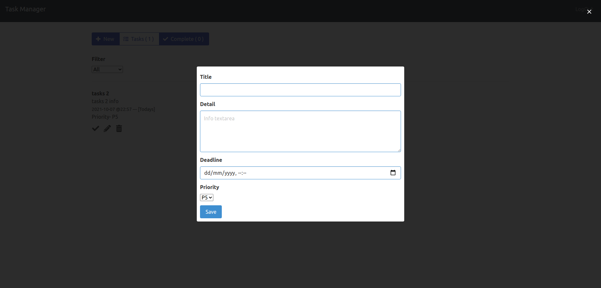

# Node js Mongodb & React, Small Task Manager


## TechStack
A Boilerplate for setup restful api's for "Nodejs and Express", Database is Mongodb.

Frontend is "React"


### Features covered are:-
1. User signup and login system
2. User is able to create task, delete task and update task from the given list of tasks.
3. Every task has feature to assign deadline to the task
4. every task that user create or edit has Priorty from P1 to P5, which user can set.
5. user can mark the task and complete or from completed task user can undo that.
6. Task are written as Overdue, Upcoming or Todays task given in the list of tasks.

## Screenshots










## Quick Start

To start with just clone ( Url needs to be added)
git clone --depth 1 git/link

cd /path/to/the/folder/

open two terminals, one for Server and other for Client

# Server

```
npm install
```

## For development purpose

```
sudo npm run docker:dev
```

The above command will start the server on your system with mongo image and node setup

and the endpoints will be as defined

## For Auth Api

http://localhost:3000/v1/auth/login
http://localhost:3000/v1/auth/signup

## For task api's

http://localhost:3000/v1/tasks/createtasks
http://localhost:3000/v1/tasks/deletetasks
http://localhost:3000/v1/tasks/updatetasks
http://localhost:3000/v1/tasks/gettasks

Backend apis can be tested on swagger as well

```
http://localhost:3000/v1/docs/#/
```

It has all the apis and one can check with authorization as well

# Client

```
npm install
then npm start
```

This will start the server on

```
http://localhost:8081/
```

This will by default open
http://localhost:8081/login screen

Go to register if you are not login and create a new user

Proper validations are there with specific messages for the respective field

Note:- Step to download docker

## Downloading Docker

### Ubuntu

- sudo apt update
- sudo apt install apt-transport-https ca-certificates curl software-properties-common
- curl -fsSL https://download.docker.com/linux/ubuntu/gpg | sudo apt-key add -
- sudo add-apt-repository "deb [arch=amd64] https://download.docker.com/linux/ubuntu bionic stable"
- sudo apt update
- apt-cache policy docker-ce

### windows

- One can download docker desktop and continue working
